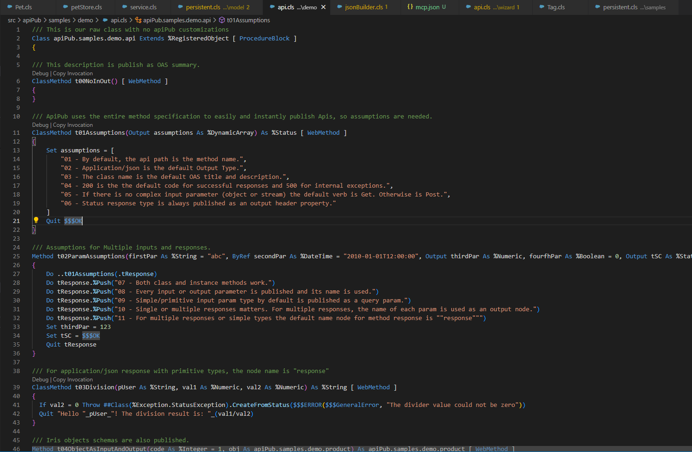
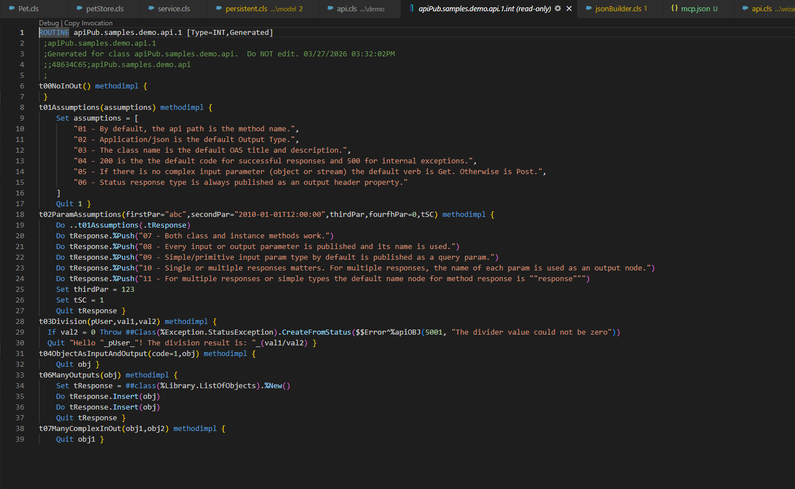
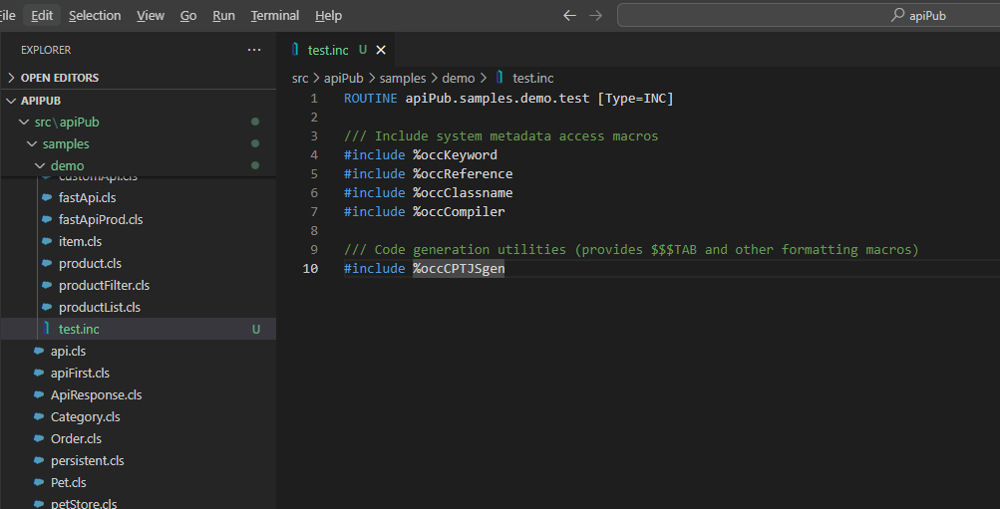
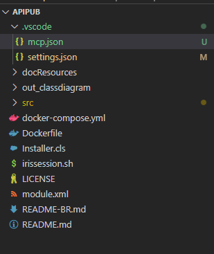
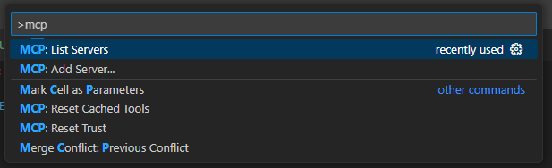
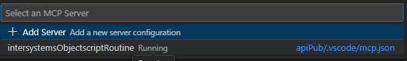
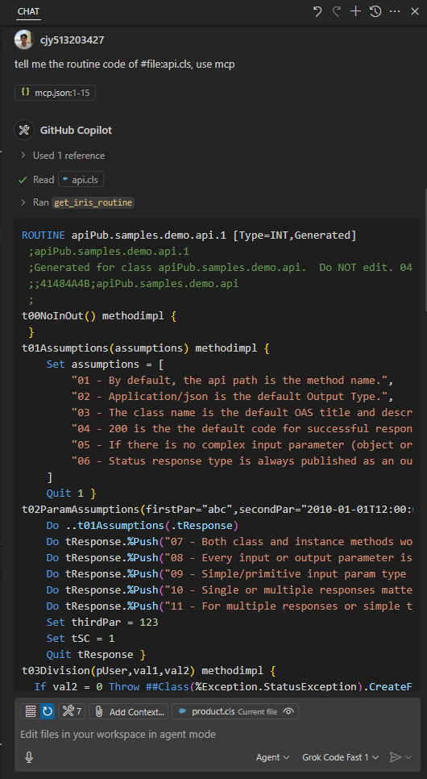
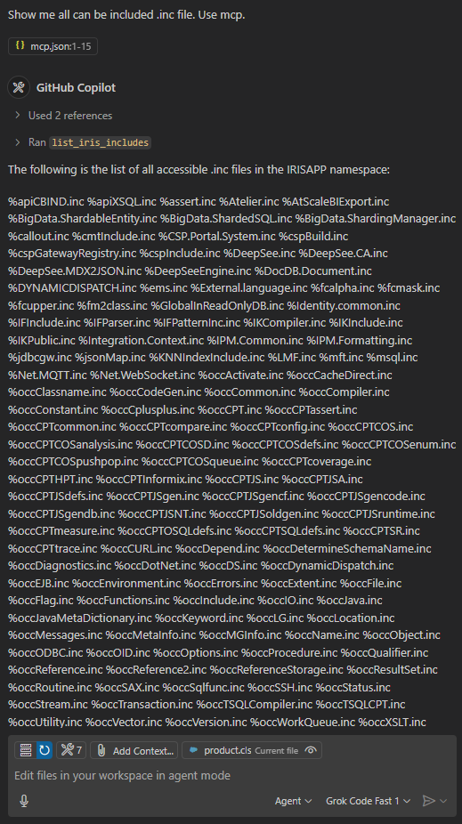
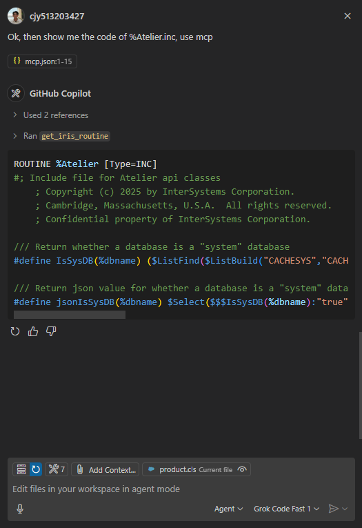

# intersystems-objectscript-routine-mcp

Read-only MCP server for InterSystems IRIS via the Atelier API. It is designed for hosts such as VSCode Copilot, Cursor or Claude Desktop and helps an LLM inspect compiled ObjectScript routines without modifying code.

GitHub is for understanding the project and reviewing the source. npm is for the shortest path to a working MCP server. The `repository` field connects both.

## What this server does

- Fetch compiled routines such as `.int`, `.mac`, and `.inc`
- Auto-resolve bare class names such as `Package.Class` to compiled routine candidates like `Package.Class.1.int`
- List accessible include files in a namespace
- Fail fast on common connection and authentication problems

## Tools

### `get_iris_routine`

Fetches the content of a compiled routine from IRIS.

- Input: `name`, optional `namespace`
- Read-only
- If you pass a class name, the server tries `.1.int` and `.int` automatically

### `list_iris_includes`

Lists accessible `.inc` files in an IRIS namespace.

- Input: optional `namespace`
- Read-only
- Uses the Atelier `action/query` endpoint and requires SQL access to `%Library.RoutineMgr_StudioOpenDialog`

## Requirements

- Node.js `>=20.0.0`
- A reachable InterSystems IRIS instance with the Atelier API available
- HTTP Basic Auth credentials with permission to read routines
- A valid default namespace via `IRIS_NAMESPACE`

## Quick start

**Default setup:** use the **published npm package**. You do **not** need to clone this repository, run a local checkout, or point your host at `src/index.ts`. The MCP host runs `npx`, which pulls the package from the registry and starts the compiled server.

### Option A: npm (recommended)

Use this for normal use. Only Node.js and host `mcp.json` are required.

Host `mcp.json`:

```json
{
  "mcpServers": {
    "intersystems-objectscript-routine-mcp": {
      "command": "npx",
      "args": ["-y", "intersystems-objectscript-routine-mcp"],
      "env": {
        "IRIS_URL": "http://localhost:52773",
        "IRIS_NAMESPACE": "USER",
        "IRIS_USERNAME": "_SYSTEM",
        "IRIS_PASSWORD": "SYS"
      }
    }
  }
}
```

Notes:

- Some hosts accept an explicit `"type": "stdio"` on the server entry; add it if yours requires it.
- If you prefer a global install, run `npm install -g intersystems-objectscript-routine-mcp` and set `"command"` to `intersystems-objectscript-routine-mcp` (and clear `args` as needed for your host).

### Option B: local clone (optional, for development)

Use this **only** if you are changing the source or you cannot use npm. It requires a git clone, `npm install`, and a path to `src/index.ts` (or local `dist` after `npm run build`).

```bash
git clone https://github.com/cjy513203427/intersystems-objectscript-mcp.git
cd intersystems-objectscript-mcp
npm install
```

Host `mcp.json` for the cloned repository (pattern verified with Cursor: `npx` + `tsx`, `cwd` set to the repo root). Replace `<path-to-repo>` with your clone path (use forward slashes on Windows, e.g. `C:/Projekte/...`).

```json
{
  "mcpServers": {
    "iris-objectscript-mcp": {
      "type": "stdio",
      "command": "npx",
      "args": ["tsx", "<path-to-repo>/src/index.ts"],
      "cwd": "<path-to-repo>",
      "env": {
        "IRIS_URL": "http://localhost:52773",
        "IRIS_NAMESPACE": "USER",
        "IRIS_USERNAME": "_SYSTEM",
        "IRIS_PASSWORD": "SYS"
      }
    }
  }
}
```

Notes:

- The server key (`iris-objectscript-mcp` here) is only a label in the host; it can differ from the npm package name.
- Run `npm install` in the repo first so dependencies and `tsx` resolve reliably.
- Alternative: `node` + `node_modules/tsx/dist/cli.mjs` works the same; `npx tsx` is often shorter to configure.

## Example
Try this MCP server with the ObjectScript project [apiPub](https://github.com/devecchijr/apiPub).

Fetch the routine for `api.cls`:\


Press `ctrl+shift+v` to view the compiled routine. In compiler terminology these are called readable intermediate code. LLMs lack this context — which is why even frontier models invent macros, because they don't know what the expanded code looks like.\


They also don't know which `.inc` files are imported, or what the `$$$xxx` macros inside them expand to.

For example, a `.inc` file may explicitly include system macros:\


If you are connected to an IRIS instance you can navigate into those macro files directly:\


Without explicitly including these system macros there is no way to reach those files — and the LLM has no visibility into them at all.\


Under the `.vscode` folder, add the following to `mcp.json`:
```json
{
  "servers": {
    "intersystemsObjectscriptRoutine": {
      "type": "stdio",
      "command": "npx",
      "args": ["-y", "intersystems-objectscript-routine-mcp"],
      "env": {
        "IRIS_URL": "http://localhost:52773",
        "IRIS_NAMESPACE": "IRISAPP",
        "IRIS_USERNAME": "_SYSTEM",
        "IRIS_PASSWORD": "SYS"
      }
    }
  }
}
```

Open VS Code Copilot in **agent** mode (the MCP tool is not invoked in other modes). Press `ctrl+shift+p` and choose `MCP: List Servers`:\


Start the MCP server:\


Ask about a routine:\


Ask to list all available `.inc` files:\


Fetch the contents of a specific `.inc` file:\


The similar MCP configuration works in other VS Code forks such as Cursor, Antigravity and Windsurf, as well as CLI tools like Claude Code and Codex.

## Environment variables

The host can pass connection settings through `env`. For local development, you can also create a `.env` file based on `.env.example`.

| Variable | Required | Description |
| --- | --- | --- |
| `IRIS_URL` | Yes | Base URL of your IRIS instance, for example `http://localhost:52773` |
| `IRIS_NAMESPACE` | Yes | Default namespace used when a tool call does not pass one |
| `IRIS_USERNAME` | Yes | Username for HTTP Basic Auth |
| `IRIS_PASSWORD` | Yes | Password for HTTP Basic Auth |


## Security notes

- Keep credentials in local host configuration or a local `.env` file only
- Do not commit secrets to Git
- Prefer least-privilege IRIS credentials for read-only inspection

## Development

```bash
npm install
npm run dev
```

Build the published entry:

```bash
npm run build
```


